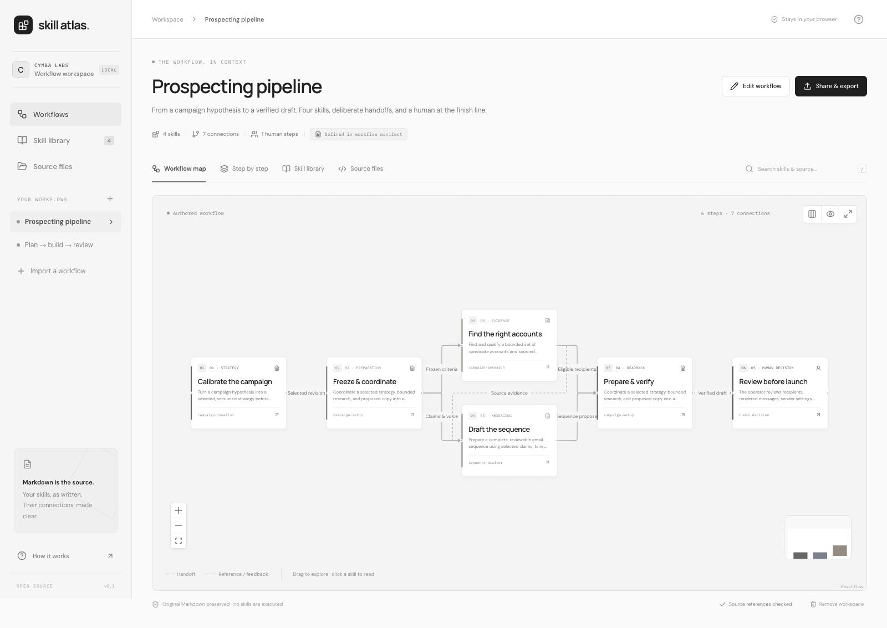
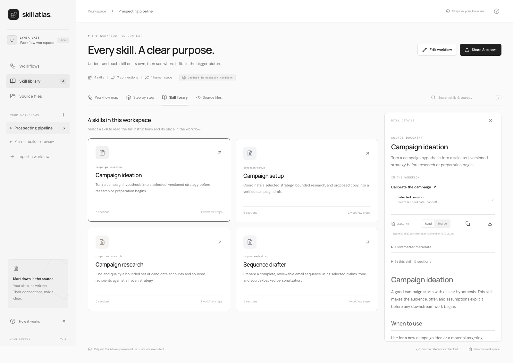

<div align="center">

# Skill Atlas

**Make the handoffs visible.**

A document-first workspace for agent skills and the workflows that connect them.
Import the Markdown. Understand each skill. Share the whole picture.

[Live demo](https://charlescarr.github.io/skill-atlas/) · [Architecture](docs/ARCHITECTURE.md) · [Contributing](CONTRIBUTING.md) · [MIT license](LICENSE)

</div>



Agent workflows often live across SKILL.md files, repository instructions, and reference documents. A list of skills tells you what exists; it doesn't explain who hands what to whom. Skill Atlas brings both views together without rewriting the source or pretending that a mention proves execution order.

## What the MVP does

- **Interactive workflow maps:** pan, zoom, drag nodes, switch direction, hide reference edges, and inspect a step. Branches, feedback, repeated skills, and human decisions are supported.
- **Full skill reading:** Markdown headings, lists, code, tables, task lists, frontmatter, and original source. Internal references open the imported document; missing references are reported.
- **Workflow editing:** define steps, phases, inputs, outputs, and named handoffs in the visual editor or versioned JSON manifest. Changes persist in the browser.
- **Recorded repository snapshots:** import public GitHub repositories at one resolved commit, or record local Git HEAD and source changes through the CLI.
- **Source review:** preview added, changed, and removed files before applying an update; retain your workflow overlay or explicitly use the incoming definition.
- **Connection evidence:** click a connection to inspect exact source excerpts and lines. Changed, missing, moved, ambiguous, and uncited evidence remain visible. Human review becomes stale after source or workflow changes.
- **Folder and bundle import:** read Codex skill directories, AGENTS.md, agent interface YAML, and supporting text resources. No account, backend, or AI API is needed.
- **Portable sharing:** self-contained offline HTML, vector SVG diagrams, editable workspace bundles, and workflow manifests.
- **Source checks:** malformed/duplicate skills, unresolved mentions, missing files, invalid manifests, and import limits are surfaced explicitly.
- **Responsive interface:** desktop and mobile layouts, keyboard controls, native modal focus management, and reduced-motion support.

The public examples are fictional: a prospecting pipeline and a plan/build/review loop. Private CLI imports are Git-ignored and absent from the production build. The app documents skills; it does not execute them.

## Run locally

Requires Node.js 22+ and npm.

```sh
git clone https://github.com/CharlesCarr/skill-atlas.git
cd skill-atlas
npm ci
npm run dev
```

Open **http://127.0.0.1:4317**. Choose **Import a workflow**, select a repository folder, and explore. Import the repository root to include linked documents outside the individual skill folders. You can also import an exported `.atlas.json` file.

Import limits: **100 skills, 1,200 source files, 8 MB total, 1 MB per file**. Media and binaries are not imported; supporting skill resources are shown as text and never executed.

### Import a private repository from the terminal

```sh
npm run import:skills -- /path/to/repository --name "My team workflow"
npm run dev
```

This writes a mode-0600 bundle into `local/`, which is excluded from Git and production builds. The development server loads it automatically. To supply an external manifest:

```sh
npm run import:skills -- /path/to/repository \
  --manifest /path/to/workflow.yaml
```

Imports are snapshots. Re-run the CLI with the same folder and name, then reload the app: an updated local snapshot is offered for comparison rather than overwriting browser edits. You can also use **Source review → Compare updated folder or bundle**. Folder-picker imports cannot inspect Git metadata and are labeled unversioned. No source repository is modified. Browser edits change the current manifest overlay; download the manifest to deliberately update the source repository.

## Keep the map trustworthy

**Import a public repository:** choose **Import a workflow → Import a public GitHub repository**. Enter `owner/repository`, a branch/tag/commit (default `HEAD`), and an optional subfolder. To try this project’s fictional example, use `CharlesCarr/skill-atlas`, `main`, and `examples/prospecting`.

The app resolves the revision once, reads its immutable tree and blobs, verifies Git blob IDs, and records the full commit, selected ref, subfolder, and import time. It rejects incomplete GitHub trees, symlinks, invalid UTF-8, oversized imports, and failed reads. GitHub’s unauthenticated API limits apply. There is no token field; import a local clone for private repositories.

**Update deliberately:** open **Source review → Check GitHub for changes**, or compare an updated local folder/bundle. Inspect the before/after source text and affected cited connections. Keep your existing workflow and citations, or select the incoming definition. Nothing is replaced until **Apply source update**. A retained workflow pointing to a removed skill blocks application; use the incoming definition/reference map or correct the workflow first. Comparing another repository or subfolder is blocked when both snapshots carry repository identities.

**Cite the instructions:** generated reference edges include the actual Markdown mention/link and its source line, including reference-link definitions. Authored handoffs are never automatically certified by a mention. Open **Edit workflow**, expand a connection’s **Source evidence**, select a source file and inclusive line range, and attach the excerpt. Save/export the manifest to version citations beside the skills. The prospecting example contains seven handoffs/references cited against its fictional sources.

Evidence stores `path`, `startLine`, `endLine`, and the exact excerpt. A unique unchanged excerpt can be relocated after lines move; changed/removed or ambiguous excerpts require attention. Clean Git snapshots offer immutable GitHub line links when a GitHub origin is known. Local changes never get a misleading link to unchanged committed text.

**Review the whole workflow:** use **Mark snapshot reviewed** after checking the instructions and handoffs. A SHA-256 fingerprint covers all imported source text and the authored manifest. The review remains valid across reloads and exports, but source or workflow edits produce **Needs review**. Broken citations block marking reviewed; uncited relationships remain labeled even after human review. This is a local human acknowledgment, not a signed attestation, skill evaluation, or execution trace.

HTML exports carry the recorded revision, review status, citations, source line anchors, and any evidence problems. Portable bundles retain source metadata and review fingerprints. Updates are checked on demand; there is no background polling, filesystem watcher, OAuth integration, repository write-back, or shared review identity.

## References versus workflows

With **only SKILL.md files**, the app draws a reference map from Markdown links and `$skill-name` mentions, including the exact inline invocation `` `$skill-name` ``. Fenced code is excluded. Reference arrows mean “mentions,” not “runs next.”

With **workflow.yaml or workflow.json**, the manifest defines reading order, step instances, and actual handoffs. One skill can appear in several steps. A human step can mark a review or decision that should never be mistaken for agent work.

```yaml
version: 1
title: Research to review
description: A small workflow with an explicit operator decision.
steps:
  - id: research
    skill: campaign-research
    title: Find the right accounts
    phase: 01 · Evidence
    inputs: [Selected strategy]
    outputs: [Eligible recipients]
  - id: draft
    skill: sequence-drafter
    phase: 02 · Messaging
    inputs: [Source evidence]
    outputs: [Sequence proposal]
  - id: review
    kind: human
    title: Operator review
    description: Review the evidence and proposal before any execution.
connections:
  - from: research
    to: draft
    label: Source evidence
    type: handoff
  - from: draft
    to: review
    label: Sequence proposal
    type: handoff
```

`skill` must match the name in SKILL.md frontmatter. Step ids must be unique; connection endpoints must exist. Connection types are `handoff`, `reference`, and `feedback`. The `steps` array is the reading order; connections show the graph. Without frontmatter, the containing folder supplies the skill name. The editor produces a valid manifest you can export without hand-writing YAML.

See [the complete prospecting example](examples/prospecting/workflow.json) for a coordinating skill used twice, parallel workstreams, and a human review.



## Share with teammates

Use **Share & export**:

| Format              | Use it for                                                                                                     |
| ------------------- | -------------------------------------------------------------------------------------------------------------- |
| Self-contained HTML | Send a complete read-only snapshot with the map, handoffs, full documents, and original source. Opens offline. |
| SVG                 | Put a crisp vector diagram into slides or team documentation.                                                  |
| `.atlas.json`       | Transfer or back up an editable workspace, including all original source files.                                |
| `workflow.json`     | Keep the current authored handoffs next to the skills in Git.                                                  |

Document exports contain the imported source text. SVG uses the automatic layout and current direction; transient dragged positions are not saved. An HTML snapshot has no scripts, font service, CDN, or automatic network requests. External source links remain explicitly clickable.

## Build, test, deploy

```sh
npm run check            # strict types, unit tests, production build
npm run verify:public    # assert private loader is absent from dist
npx playwright install chromium
npm run test:e2e         # desktop and mobile browser tests
npm run preview         # production preview on port 4317
```

CI runs type checks, unit tests, builds, public-build checks, and both browser projects. The **Publish demo** workflow deploys `dist/` to GitHub Pages when manually dispatched. For a fork, select **GitHub Actions** in Settings → Pages and run that workflow. The relative Vite base also supports other static hosts.

Private imports are local to your browser or your development checkout. There is no server-side collaboration or synchronization in this MVP. Share an HTML snapshot for reading or a bundle for editing. Imported raw HTML is discarded, unsafe URL protocols are blocked, and referenced images are not fetched automatically. Markdown and its relationships remain the source of truth.

Built with React, TypeScript, Vite, React Flow, Dagre, YAML, unified, and react-markdown. Interface fonts: DM Sans, Manrope, and IBM Plex Mono, bundled with the app. See [the architecture](docs/ARCHITECTURE.md) for contracts, boundaries, and module responsibilities.
