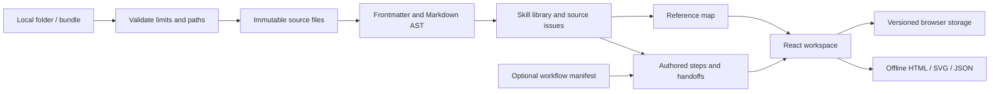

# Architecture

Skill Atlas is a static React application built with Vite and strict TypeScript. React Flow handles interactive diagrams; Dagre computes graph positions. YAML, unified, remark-parse, and remark-gfm read source metadata and Markdown. react-markdown renders documents without raw HTML. Fonts are bundled locally.

## Data flow

A workspace bundle carries the original files and an optional version 1 manifest. `buildWorkspace` derives skills, relationships, and source issues without mutating the originals. A file named SKILL.md identifies a skill. Name and description come from YAML frontmatter, with a directory-name and heading fallback for skills without metadata. Arbitrary frontmatter fields remain available for inspection.

Dollar mentions are extracted from Markdown text nodes, excluding fenced code. An inline code span containing exactly `$skill-name` is treated as a skill reference, matching Codex invocation conventions. Markdown links and reference-style links resolve to imported files. Duplicate names produce an error and omit the ambiguous duplicate. Malformed skills appear in source issues. A workspace with no valid skills is rejected. Missing skill mentions and linked files are warnings.

Without a manifest, every edge is explicitly a reference. With a manifest, ordered steps and labeled connections describe an authored interpretation of the instructions. The manifest can contain repeated uses of the same skill, branches, loops, and human decisions. Reading order is the steps array, not an inferred topological order. Dagre lays out forward handoffs; feedback edges remain visible without affecting forward rank. No diagram describes observed execution.

## Boundaries

Browser imports are local file reads, followed by browser localStorage persistence. There is no backend, telemetry, AI model call, or uploaded document store. Storage failures leave the current session functional and produce an export reminder. Invalid imports do not replace a valid workspace. The dialog uses the native modal focus trap.

The development-only Vite middleware exposes `local/*.json` on the loopback development server. It has no production implementation. The CLI skips symlinks and dependency/build directories, imports Markdown, agent interface YAML, skill supporting text resources, and the workflow manifest, and writes a mode-0600 bundle in Git-ignored `local/`. Production builds contain public examples only; browser imports made after deployment remain in that browser.

Import limits: 1,200 source files, 100 skills, 150 manifest steps, 600 connections, 8 MB of source text per workspace, and 1 MB per file. The parser uses YAML alias limits and rejects circular metadata. Relative paths cannot escape the selected import root.

Markdown raw HTML is discarded. Markdown URL transformation blocks unsafe protocols. Imported images are replaced with descriptive placeholders to avoid automatic external requests. Internal document links open imported files; missing files show a notice. External links open explicitly in a separate tab. Exports escape user-controlled text and render Markdown through the same safe renderer.

## Exports

- **HTML:** a complete read-only snapshot containing a vector diagram, step inputs/outputs, full documents, original source in disclosure panels, and source issues. It has no scripts or external assets and works offline. Links to included documents become anchors. External links require an explicit click.
- **SVG:** a deterministic diagram with the selected horizontal or vertical direction, relationship labels, and a legend. It exports the automatic layout, not transient drag positions.
- **Bundle JSON:** lossless source files and current authored manifest, ready to reimport.
- **Manifest JSON:** workflow metadata only, ready to save as workflow.json alongside the skills.

The workflow editor changes the bundle's current manifest. It never rewrites imported source files, including an originally imported manifest file. Download the current manifest to deliberately update the source repository. Skill text editing and live filesystem watching are outside this MVP.

## Modules

| Module                            | Responsibility                                        |
| --------------------------------- | ----------------------------------------------------- |
| src/lib/workspace.ts              | Source parsing, validation, reference resolution      |
| src/lib/types.ts                  | Versioned source, bundle, skill, step, edge contracts |
| src/lib/layout.ts                 | Automatic graph layout and shared dimensions          |
| src/lib/storage.ts                | Browser persistence and failure handling              |
| src/lib/export.tsx                | Escaped, self-contained exports                       |
| src/components/WorkflowMap.tsx    | Interactive canvas, selection, pan/zoom               |
| src/components/WorkflowEditor.tsx | Step/relationship editing and manifest validation     |
| src/components/Markdown.tsx       | Safe Markdown, internal file navigation               |
| src/App.tsx                       | Workspace composition, imports, navigation, inspector |
| scripts/import-skills.ts          | Local filesystem import into private bundles          |

## Verification

Unit tests exercise source fidelity, multiline YAML, reference-style links, code exclusion, missing/duplicate skills, manifest validation, limits, roundtrips, and export injection resistance. Playwright exercises imports, editor persistence, missing references, document navigation, export contents/offline behavior, focus, diagram direction, and desktop/mobile overflow. CI runs these checks and a public-build separation check. No backend or external integration is required.
